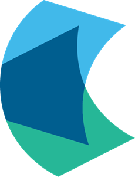
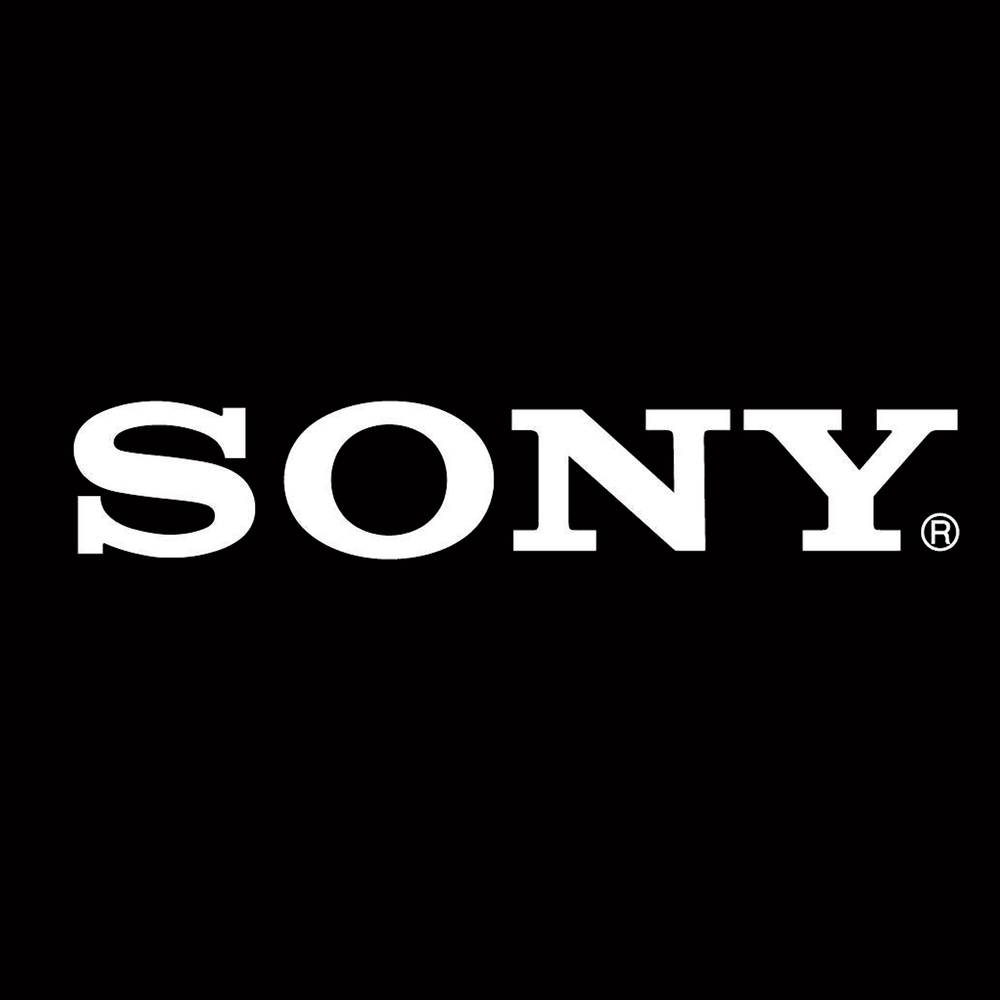
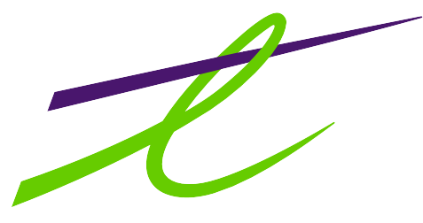
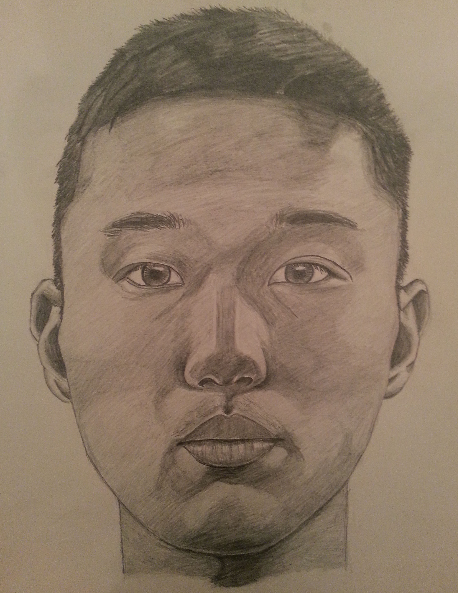
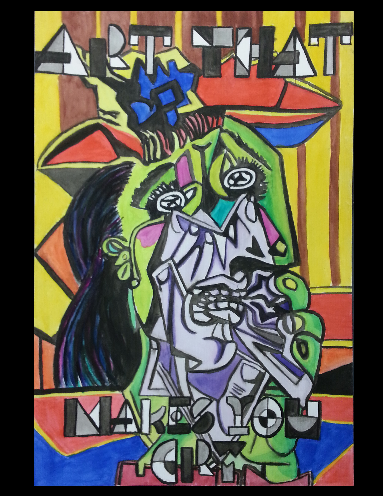

---
# You don't need to edit this file, it's empty on purpose.
# Edit theme's home layout instead if you wanna make some changes
# See: https://jekyllrb.com/docs/themes/#overriding-theme-defaults
layout: single
permalink: /
author_profile: true
title: Welcome to my personal website!
---

My name is MyungJae (Andrew) Lee. I am a University of Waterloo student studying Computer Science.

To know more about me, check out my [about page](/about/).

## Internships
I have interned at Facebook, Zynga, Google, Hubdoc, Sony, and Telus. Find out more on my [work experiences page](/experience/).

## Artwork
I love drawing on my free time. Go to the [artwork page](/artwork/) to see more.

## Side Projects
I've created many side projects. Check them out on my [side projects page](/project/).

